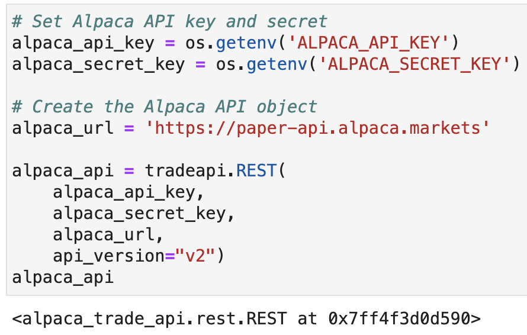
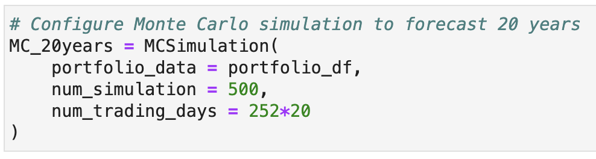
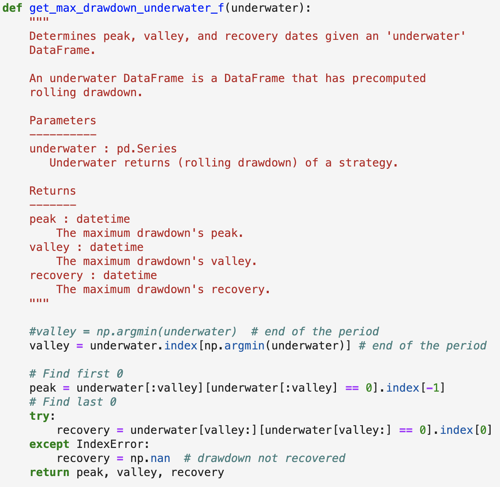
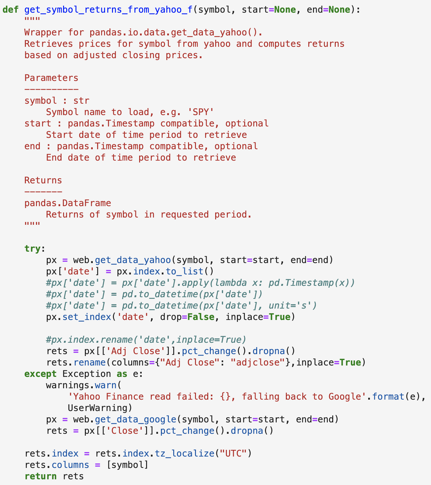
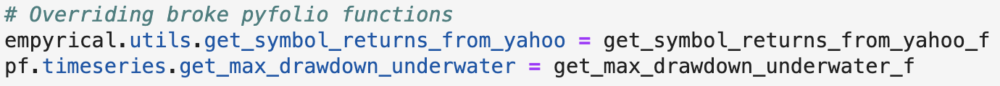

# Group Project 1: Sector Dominance

The following code was developed in the sector_data_analysis notebook as a tool to facilitate investment planning by sector analysis. It uses the Alpaca API to fetch historical closing prices for ETFs that represent each sector of the S&P 500. After the data has been cleaned, the code analyzes and visualizes risk, returns, votality, and Sharpe ratios of individual sectors against the S&P 500. Next it runs two Monte Carlo simulations, one to project performance of a portfolio equally distributed across sectors at 20 years and one to project our portfolio performance at 20 years. Then the Monte Carlo data is used to calculate the expected portfolio returns given a specific initial investment amount. Finally, tear sheets are created in the portfolio_tear_sheets notebook as a quick reference to the sectors in our portfolio.

---

## Technologies

Language: Python3, Pandas 

Imports: pandas, numpy, dotenv, pandas_datareader, empyrical, pyfolio, plotly.express, pn.extension('plotly'), matplotlib, matplotlib.pyplot, panel, hvplot.pandas, alpaca_trade_api and MCForecastTools

External Resources: Alpaca Markets API

Developed with JupyterLab

---

## Installation

JupyterLab - [Install JupyterLab](https://jupyterlab.readthedocs.io/en/stable/getting_started/installation.html)

---

## Examples
Creating the Alpaca API object:

Loop to make multiple queries to pull more data than 1000 day Alpaca limit:

Configuring Monte Carlo simulation:

Functions needed to fix Pyfolio library:

The first function determines peak, valley, and recovery dates given an 'underwater' DataFrame.

The second function is a wrapper for pandas.io.data.get_data_yahoo().

This code overrides the broken fuctions in the Pyfolio library and replaces them with the new functions.

---

## Contributors

Drew Disbrow Marnell: dldmarnell@gmail.com

Matt Epler: epler.matt@gmail.com

Yoko Yamamoto: yyamamo222@gmail.com

Scott Alexander: swalexan2@gmail.com

---

## License

MIT License
Copyright (c) 2021 Drew Disbrow Marnell